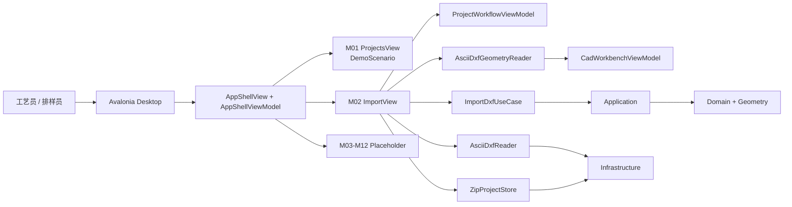
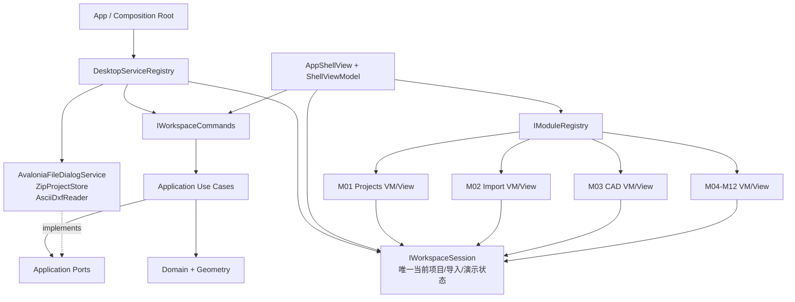

# T00–T02 架构评审：UI Shell、项目订单、DXF 导入

**评审日期**：2026-08-13  
**范围**：当前已实现的 T00 共享 Shell、T01 项目订单页、T02 DXF 导入页；不评审尚未完成的 T03–T12 业务实现。  
**结论**：当前架构适合“可点击 UI 演示”的第一步，且核心领域项目的依赖方向总体正确；但还不适合让 12 个模块并行接入真实逻辑。应在继续大量模块开发前完成 P0 的“应用组成根 + 单一工作区会话 + 稳定导航实例”收口，否则会出现页面切换丢状态、重复实例化基础设施、项目/导入/工艺工作台彼此不同步的问题。

## 1. 已核实的基线

| 项目 | 结果 |
| --- | --- |
| 构建 | `dotnet build LeatherNesting.sln --no-restore` 通过，0 warning / 0 error。 |
| Desktop 测试 | `dotnet test tests/LeatherNesting.Desktop.Tests/LeatherNesting.Desktop.Tests.csproj --no-restore` 通过，15/15。 |
| 层级依赖 | `Domain` 无上层依赖；`Geometry → Domain`；`Application → Domain + Geometry`；`Infrastructure → Application + Domain + Geometry`；`Desktop → Application + Infrastructure`。方向正确。 |
| 已落地模块 | T00 有 `Shell/`、`DesignSystem/`、`Demo/`；T01 有 `Modules/Projects/`；T02 有 `Modules/Import/`。 |
| 当前 TODO 合同 | `TodoBadge.StandardText` 是单一文本来源；T01 写入型动作不修改演示数据；Shell 未实现命令仅写检查器提示。 |

## 2. 当前架构（事实）

### 当前状态的优点

1. **核心工程依赖方向健康**：领域与几何没有反向依赖 Desktop 或 Infrastructure；DXF 读取和项目 ZIP 存储已在 Infrastructure。
2. **演示/真实能力已开始分离**：`DemoScenario` 为 T01 提供只读示例，T02 保留真实 DXF 检查和单位确认，避免把所有页面都伪装成真逻辑。
3. **目录按模块切分正确**：`Modules/Projects`、`Modules/Import` 使后续 Agent 有明确文件所有权。
4. **TODO 可审计**：单一 `TodoBadge` 文本和 T01 的无副作用 ViewModel 测试，是很好的演示阶段安全护栏。

## 3. 架构评估与发现

| ID | 优先级 | 发现 | 证据 | 影响 | 建议 |
| --- | --- | --- | --- | --- | --- |
| AR-01 | P0 | Shell 导航的 `Func<Control>` 每次切换都会创建新页面实例。 | `AppShellView.ShowModule()` 调用 `module.CreateView()`；描述符直接 `() => new ImportView()`。 | 从 M02 切走再回来会新建 `ProjectWorkflowViewModel`、重新建立项目/导入会话；T01 的页面级选择也会丢失。跨模块不能共享当前项目。 | 引入 `IWorkspaceSession` 和 `IModuleViewFactory`；Shell 缓存 moduleId→View，或使用单例模块 ViewModel，页面只重建视图不重建会话。 |
| AR-02 | P0 | `ImportView` 是服务定位/组成根：它直接 `new AsciiDxfReader`、`ImportDxfUseCase`、`ZipProjectStore`、`AsciiDxfGeometryReader`、`CadWorkbenchViewModel`。 | `Modules/Import/ImportView.cs` 字段和 `EnterWorkbenchAsync()`。 | View 同时负责展示、工作流协调、基础设施构造、文件存储和导航；未来 M01/M03/M11 无法复用同一项目状态，单测只能测局部。 | 只在 `App`/CompositionRoot 组装依赖；`ImportViewModel` 接受 `IProjectWorkspace`、`IFileDialogService`、`IProjectStore`、`ImportDxfUseCase`、`ICadWorkbenchLauncher` 接口。 |
| AR-03 | P0 | 当前没有“当前项目”的单一来源。 | T01 固定 `DemoScenarioFactory.Default`；T02 私有 `ProjectWorkflowViewModel`；Shell 检查器/状态栏也固定 DemoScenario。 | 用户在 T02 成功导入/保存后，Shell、M01、后续 M03–M12 仍显示不同的演示项目；无法演示端到端真实流程。 | 建立 `WorkspaceSession`：真实 `ProjectDocument?` + `ImportDxfPreparation?` + 只读 `DemoScenario` + `WorkspaceMode (Demo/Real)`；所有页面从它读当前项目摘要。 |
| AR-04 | P1 | `ProjectWorkflowViewModel` 名称虽为 ViewModel，却是无通知的应用协调器。 | 属性无 `INotifyPropertyChanged`，View 每次命令后手动 `Refresh()`。 | 随着状态、后台运行、多个模块增加，UI 容易不同步且存在重复 Refresh。 | 将其下沉/改名为 `ProjectImportSession`（Application 或 Desktop presentation service）；ViewModel 负责绑定/通知。短期可以保持类但为 `StateChanged` 提供事件。 |
| AR-05 | P1 | `IFileDialogService` 和 `IProjectStore` 已定义却未被 Desktop 使用。 | `Application/Ports.cs`；`ImportView` 直接用 Avalonia Storage 和 `ZipProjectStore`。 | 已有 Ports 形同虚设，阻碍 headless UI 测试和多平台实现替换。 | 提供 `AvaloniaFileDialogService`（Infrastructure/Desktop adapter）和向 Shell 注入 `IProjectStore`；删除无使用端口或真正使用。 |
| AR-06 | P1 | Import 业务流程被复制/分叉：检查读取 `AsciiDxfReader`，进入工作台再用 `AsciiDxfGeometryReader` 重新读源路径。 | `InspectAsync()` 与 `EnterWorkbenchAsync()`。 | 相同文件被解析两次但实体/几何模型不一致；单位决定、诊断、修复会话和当前项目没有贯通。 | 在提交导入后产生 `ImportedCadDocument`（原始实体、规范化几何、诊断、源指纹）；M03 从会话获取，而不是重新读取路径。 |
| AR-07 | P1 | Shell 的“真实能力”标识不准确：M02 标记为 true，但 Shell 顶栏“保存”仍总是 TODO，真实保存仅藏在 Import 页。 | `AppShellViewModel` 与 `AppShellView.BuildTopBar()`。 | 用户看见的顶部工作流和实际能力不一致，演示时容易误导。 | CommandBar 用 `IWorkspaceCommands`；每项声明 `Real/Disabled/Todo` 状态和原因，由会话动态决定。 |
| AR-08 | P2 | T00 的测试验证元数据，不验证 UI 集成。 | `ShellTests` 只测 12 个 descriptor 和 TODO 字符串；`ProjectsTests` 只测数据/VM。 | 页面构造、导航缓存、TODO 控件可见性、尺寸布局和真实入口回归无法发现。 | 引入 Avalonia.Headless；新增 shell 导航/实例保持/命令状态测试；为 1366×768 建立截图或最小布局回归。 |
| AR-09 | P2 | `DemoScenario` 是一个不断扩张的扁平 record。 | 现有 20+ 字段与三个 history list。 | M06–M12 加字段后会频繁冲突，子 Agent 会在共享文件争用。 | 拆为不可变子对象：`DemoProjectSummary`、`DemoOrder`、`DemoMaterial`、`DemoNestingPlan`、`DemoValidation`、`DemoExport`；保持 `DemoScenario` 为组合根。 |
| AR-10 | P2 | `AppTheme` 是 C# 静态笔刷，而非可绑定主题资源。 | `DesignSystem/AppTheme.cs`。 | 暗色/浅色、可访问性、控件一致性和运行时主题切换难做；模块会散落硬编码。 | 演示期保留；在 T13 前升级为 Avalonia resource dictionary/Styles，`AppTheme` 只保留语义 key 或移除。 |

## 4. 推荐目标架构

### 必须新增的边界

| 边界 | 职责 | 禁止事项 |
| --- | --- | --- |
| `IWorkspaceSession` | 当前真实项目、待确认导入、导入后的 CAD 文档、当前模式和状态变化通知。 | 不直接渲染 Avalonia 控件；不直接解析文件或写 ZIP。 |
| `IWorkspaceCommands` | 新建、检查导入、确认单位、取消、保存、打开工艺工作台等工作流命令。 | 不返回 Avalonia `Control`；不在 View 中 new Infrastructure。 |
| `IModuleRegistry` | 12 个 module id、标题、分组、ViewModel factory、是否可用/是否 TODO。 | 不用 `Func<Control>` 承载业务状态。 |
| 模块 ViewModel | 将会话状态转为可绑定页面状态，暴露命令和 TODO 解释。 | 不依赖 `AsciiDxfReader`、`ZipProjectStore` 或其他 View。 |
| 模块 View | 绑定/布局/用户输入转发。 | 不包含持久化、文件解析、项目状态机。 |

## 5. P0 收口计划（应在大规模并行模块前完成）

1. **创建组成根**：在 Desktop 新增 `Composition/ServiceRegistry.cs`，唯一位置构造 `AsciiDxfReader`、`ImportDxfUseCase`、`ZipProjectStore`、文件对话框适配器和 `WorkspaceSession`。
2. **创建工作区会话**：新增 `Shell/IWorkspaceSession.cs`、`Shell/WorkspaceSession.cs`，持有 `ProjectDocument`、`ImportDxfPreparation`、`ImportedCadDocument` 和模式；通过事件或 observable 通知 UI。
3. **稳定模块实例**：`ModuleDescriptor` 改为描述 VM 工厂/模块 key；`AppShellView` 对模块视图建立缓存。第一阶段至少保证 M01 与 M02 切换后同一会话仍在。
4. **抽取 Import ViewModel**：`ImportView` 仅布局；把浏览、检查、确认、取消、保存、进入工作台迁到 `ImportViewModel` + `IWorkspaceCommands`。保留当前 `ProjectWorkflowViewModel` 为底层协调器或改名，不能在 View 直接 new 它。
5. **统一 Shell 状态/命令**：顶部和底部通过 `WorkspaceSession` 显示真实项目或显式 `DEMO`，不再固定 `DemoScenarioFactory.Default`；保存命令与 M02 使用同一个 command。
6. **定义导入交接对象**：将 `AsciiDxfGeometryReader` 产生的闭合 loop 与 import inventory 绑定为 `ImportedCadDocument`，使 M03 从 session 取得已确认输入而非二次按路径读取。

这些改造不会实现 T03–T12 的业务逻辑，也不取消 TODO；它们只建立真实能力将来能安全接入各模块的连接点。

## 6. ADR

### ADR-UI-001：以工作区会话作为跨模块状态唯一来源

- **背景**：T01 是静态 Demo，T02 私有真实 workflow，Shell 又固定 Demo，已出现三份“当前项目”。
- **选项**：A. 每页继续各自保存状态；B. 全局静态单例；C. 注入 `IWorkspaceSession`。
- **决定**：C。由应用组成根创建一个 scoped desktop session，所有模块通过接口读取，状态变化有通知。
- **后果**：需要先写状态契约和测试；换来页面切换保持、真实/演示模式明确、模块不会互相依赖 View。

### ADR-UI-002：基础设施仅在组成根组装

- **背景**：`ImportView` 当前直接构造 reader/store/workbench。
- **选项**：A. 保留 View 直接 new；B. Service Locator；C. Constructor injection + composition root。
- **决定**：C。
- **后果**：初期文件更多，但 Application Ports 可真正使用，headless 测试和未来替换 DXF/存储实现不受 UI 约束。

### ADR-UI-003：模块注册保存模块身份，不保存临时 Control 工厂

- **背景**：`Func<Control>` 令每次导航重建 ImportView，丢失状态。
- **选项**：A. 继续每次 new；B. 缓存 Controls；C. 保持 ViewModel，按需创建 View。
- **决定**：近期 B 快速止血；目标 C，模块 registry 以 module key/ViewModel factory 注册，Shell 缓存可视实例。
- **后果**：页面不会丢失状态；需要明确 module 生命周期和释放策略。

## 7. 对 T00–T02 的判定

| 维度 | 结论 | 说明 |
| --- | --- | --- |
| UI 演示框架 | **通过，但需 P0 收口后扩展** | 12 模块导航、TODO 约束、目录分权方向正确。 |
| 业务解耦 | **部分通过** | 核心工程层正确；Desktop 内部 M02 View 的职责过多。 |
| 真实工作流完整性 | **未通过作为端到端基线** | 当前项目/导入/工作台会话不统一，导航会重建模块。 |
| 并行开发准备度 | **有条件通过** | 可并行写纯演示 M05–M12；M03/M04 及任何真实工作流模块应等待 P0。 |
| TODO 诚实性 | **通过** | T01、Shell 已遵循；后续模块必须延续并自动测试。 |

## 8. 给后续 Agent 的硬约束

1. 不在任何 `View` 中 `new AsciiDxfReader`、`ZipProjectStore`、`ImportDxfUseCase`、`CadWorkbenchViewModel` 或其他模块 ViewModel。
2. 模块只能依赖 `IWorkspaceSession`、本模块 ViewModel、Application Port/Use Case 的接口；不依赖兄弟模块的 View。
3. 所有实时项目数字优先来自 `IWorkspaceSession`；Demo 数据必须带 `DEMO` 标记。
4. TODO 动作不能改变 `ProjectDocument`、不能写文件、不能显示“成功”。
5. 每个模块增加 UI/VM 测试，至少覆盖：页面可构造、可见 TODO、会话输入变化后显示更新、无效动作不产生写入。
