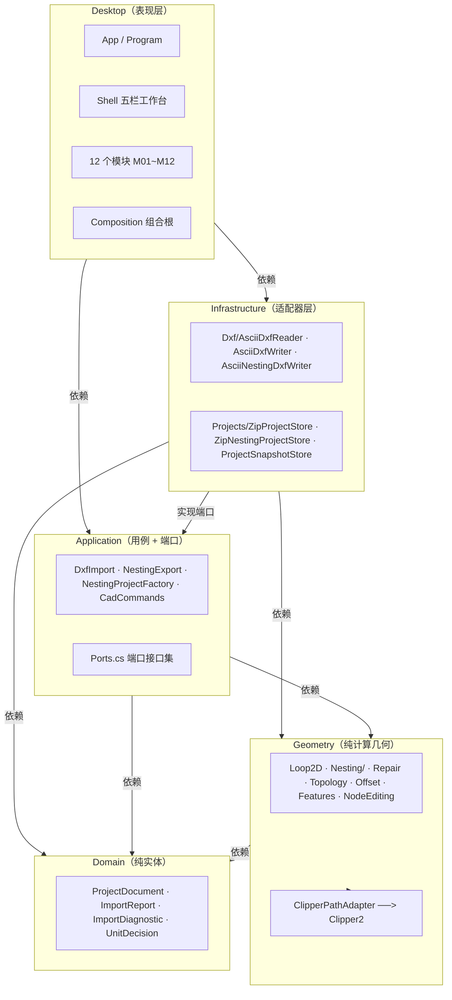
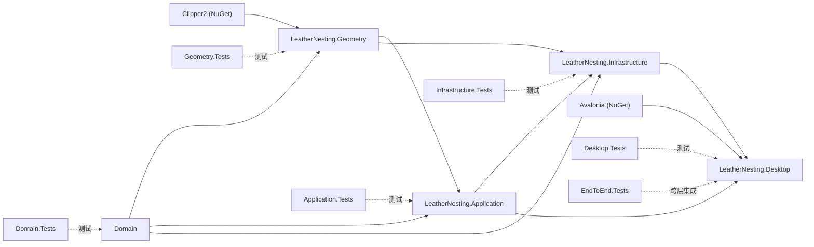
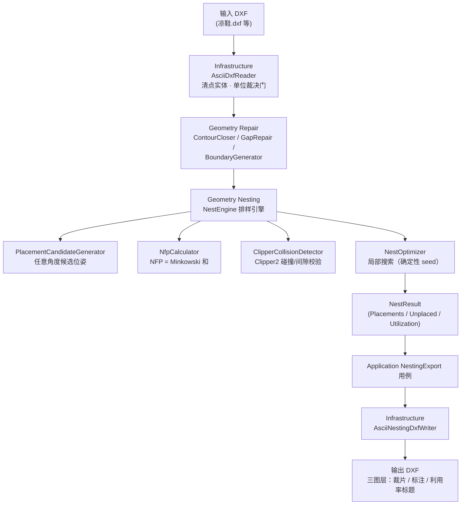
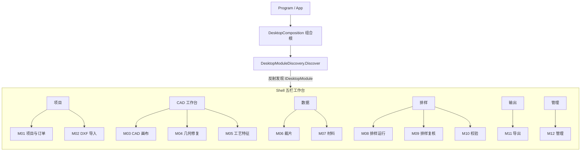

# 系统架构图

> 本文件是「皮革划线排样软件」的**图形化架构参考**：分层、依赖、数据流、算法链、桌面模块与测试镜像，每个视图均提供 **ASCII**（终端 / git 友好）与 **Mermaid**（编辑器 / GitHub 渲染）两种表达。
>
> 文字版架构基线、职责说明与治理方向见 [architecture-and-governance.md](./architecture-and-governance.md)；各技术决策见 [docs/adr/](./adr/)。

---

## 1. 分层架构（Clean Architecture / 端口-适配器）

五层自外向内单向依赖，内层永不引用外层；I/O 收敛在两端（读 DXF 进、写 DXF 出）。

### ASCII

```
┌───────────────────────────────────────────────────────────────────────────────┐
│  Desktop（表现层 · Avalonia + MVVM + 组合根）           102 个源文件            │
│    App/Program │ Shell 五栏工作台 │ 12 个模块 M01~M12 │ Views/ViewModels       │
└──────────────▲──────────────────────────────────────────────▲────────────────┘
               │ 依赖（调用 Application 用例）                  │ 依赖
┌──────────────┴───────────────┬──────────────────────────────┴────────────────┐
│  Infrastructure（适配器层 · 唯一懂外部格式的地方）           8 个源文件          │
│    Dxf/AsciiDxfReader · AsciiDxfWriter · AsciiNestingDxfWriter                │
│    Projects/ZipProjectStore · ZipNestingProjectStore · ProjectSnapshotStore   │
└──────────────▲──────────────────────────────┬────────────────────────────────┘
               │ 实现端口                       │ 依赖
┌──────────────┴───────────────┬──────────────┴────────────────────────────────┐
│  Application（用例编排 + 端口定义）           14 个源文件                      │
│    DxfImport(导入用例) · NestingExport(导出用例) · NestingProjectFactory      │
│    CadEditing/CadCommands 命令栈 · Ports.cs 端口接口集                        │
└──────────────┬───────────────┬────────────────────────────────────────────────┘
               │ 依赖           │ 依赖
┌──────────────┴───────┐   ┌────┴──────────────────────────────────────────────┐
│  Geometry（纯计算几何） │   │  Domain（纯实体 / 值对象）        1 个源文件        │
│    32 个源文件         │   │    ProjectDocument · ImportReport               │
│    Loop2D/Curve2D/    │   │    ImportDiagnostic · UnitDecision               │
│    Point2D/Transform  │   │    不可变 record + with 表达式                    │
│    Nesting/（排样引擎） │   │    零依赖                                       │
│    Repair · Topology  │   │                                                 │
│    Offset · Features  │   │                                                 │
│    NodeEditing        │   │                                                 │
│    ClipperPathAdapter │   │                                                 │
│      └─→ Clipper2     │   │                                                 │
└───────────────────────┘   └─────────────────────────────────────────────────┘
```

### Mermaid



> 注意：`Infrastructure → Application` 不是违规，而是「端口在 Application、实现在 Infrastructure」的自然结果（见 [ADR 02-职责](./adr/02-职责.md) 与治理文档 P1）。

---

## 2. 工程 / 测试依赖图

### ASCII

```
LeatherNesting.sln
│
├── src/                              依赖方向（→ 表示「引用」）
│   ├── LeatherNesting.Domain            ──────（零依赖）──────
│   ├── LeatherNesting.Geometry    ─────→ Domain + Clipper2(NuGet)
│   ├── LeatherNesting.Application ─────→ Domain + Geometry
│   ├── LeatherNesting.Infrastructure ──→ Domain + Application + Geometry
│   └── LeatherNesting.Desktop     ─────→ Application + Infrastructure + Avalonia(NuGet)
│
└── tests/                          与 src/ 1:1 镜像
    ├── LeatherNesting.Domain.Tests
    ├── LeatherNesting.Geometry.Tests
    ├── LeatherNesting.Application.Tests
    ├── LeatherNesting.Infrastructure.Tests
    ├── LeatherNesting.Desktop.Tests
    └── LeatherNesting.EndToEnd.Tests   （跨层集成）
```

### Mermaid



---

## 3. 数据流（运行时）

### ASCII

```
   ┌────────────┐        ┌────────────────────┐        ┌─────────────────────┐
   │  输入 DXF   │        │  Desktop 模块       │        │  用例 + 适配器        │
   │ 凉鞋.dxf 等 │        │  M02 导入 → M03 画布 │        │                      │
   └─────┬──────┘        └─────────┬──────────┘        └──────────┬──────────┘
         │                          │                              │
         ▼                          ▼                              ▼
   ┌──────────────────────────────────────────────────────────────────────┐
   │  Infrastructure  Dxf/AsciiDxfReader                                  │
   │    清点实体 → 识别闭合 LWPOLYLINE/POLYLINE → 单位裁决门（未确认毫米即阻塞）│
   └───────────────────────────────────┬──────────────────────────────────┘
                                        │ Loop2D 原始轮廓
                                        ▼
   ┌──────────────────────────────────────────────────────────────────────┐
   │  Geometry  Repair  ContourCloser / GapRepair / BoundaryGenerator     │
   │     修复并闭合 → 合法 Loop2D                                          │
   └───────────────────────────────────┬──────────────────────────────────┘
                                        │
                                        ▼
   ┌──────────────────────────────────────────────────────────────────────┐
   │  Geometry  Nesting/  排样引擎 NestEngine                              │
   │   ├─ PlacementCandidateGenerator    生成任意角度候选位姿（ADR-02）      │
   │   ├─ NfpCalculator                  NFP = Minkowski 和，求无碰撞贴靠点  │
   │   ├─ ClipperCollisionDetector       Clipper2 布尔做碰撞/间隙校验        │
   │   └─ NestOptimizer.Optimize         局部搜索（确定性 seed）             │
   └───────────────────────────────────┬──────────────────────────────────┘
                                        │ NestResult（利用率 Utilization）
                                        ▼
   ┌──────────────────────────────────────────────────────────────────────┐
   │  Application  NestingExport 用例 → Infrastructure AsciiNestingDxfWriter│
   │     组装三图层 DXF（裁片 / 标注 / 利用率标题）→ 落盘                      │
   └──────────────────────────────────────────────────────────────────────┘
```

### Mermaid



---

## 4. 桌面模块（M01~M12）

Shell 五栏工作台通过 `DesktopModuleDiscovery` 反射发现 `IDesktopModule`，`DesktopComposition`（唯一组合根）装配各模块工厂。

### ASCII

```
┌─────────────────────────────── Shell 五栏工作台 ───────────────────────────────┐
│                                                                               │
│  [项目]    M01 项目与订单 │ M02 DXF 导入                                        │
│  [CAD 工作台] M03 CAD 画布 │ M04 几何修复 │ M05 工艺特征                         │
│  [数据]    M06 裁片 │ M07 材料                                                  │
│  [排样]    M08 排样运行 │ M09 排样复核 │ M10 校验                                │
│  [输出]    M11 导出                                                            │
│  [管理]    M12 管理                                                            │
│                                                                               │
│  装配：Program → App → DesktopComposition（组合根）                            │
│        → DesktopModuleDiscovery.Discover(反射) → 12 个 IDesktopModule          │
└───────────────────────────────────────────────────────────────────────────────┘
```

### Mermaid



> 模块身份与命名空间对应：`M01 项目与订单`=`ProjectsModule` · `M02`=`ImportModule` · `M03`=`CadCanvasModule` · `M04`=`GeometryRepairModule` · `M05`=`ProcessFeaturesModule` · `M06`=`PiecesModule` · `M07`=`MaterialsModule` · `M08`=`NestingRunModule` · `M09`=`NestingReviewModule` · `M10`=`ValidationModule` · `M11`=`ExportModule` · `M12`=`AdministrationModule`。

---

## 5. 业务边界与输出契约

```
                ┌─────────────────────────────────────────────┐
                │  本软件负责（核心职责：排样）                  │
                │   1. 读入裁片轮廓（DXF）                      │
                │   2. 排样 nesting（任意角度 / 自由旋转）      │
                │   3. 输出排样结果文件（DXF 先行，JSON 暂缓）   │
                └─────────────────────────────────────────────┘
                                     │
                不负责（交给下游切片软件）│
                                     ▼
                ┌─────────────────────────────────────────────┐
                │  切割刀路（toolpath / G-code）生成            │
                │  切片软件的厂商兼容适配（标准格式解耦）        │
                └─────────────────────────────────────────────┘
```

- **输出格式**：DXF 与 JSON 两种都要；**先 DXF，JSON 暂缓**（见 [ADR 02-职责](./adr/02-职责.md)）。
- **DXF 颜色约定**（ACI 62）：`0`=外轮廓 Bound、`3`=切割线 Cutoff（切穿）、`5`=标记线/刀口（半切/记号）。
- **位姿范围**：任意角度（自由旋转），毛向/纹路等约束在任意角度基础上叠加。

---

## 6. 相关文档

| 文档 | 内容 |
|---|---|
| [architecture-and-governance.md](./architecture-and-governance.md) | 架构基线 + 治理方向（文字版） |
| [adr/01-dxf-adapter.md](./adr/01-dxf-adapter.md) | DXF 适配决策（自研 reader，弃 netDxf） |
| [adr/02-职责.md](./adr/02-职责.md) | 职责边界与输出契约 |
| [adr/03-技术栈选择.md](./adr/03-技术栈选择.md) | 技术栈选择 |
| [adr/04-逆向axenester算法.md](./adr/04-逆向axenester算法.md) | 逆向排样算法 |
| [adr/05-排样算法-csharp-vs-cpp.md](./adr/05-排样算法-csharp-vs-cpp.md) | 排样算法语言选择（C# 托管 vs C++ 下沉） |
